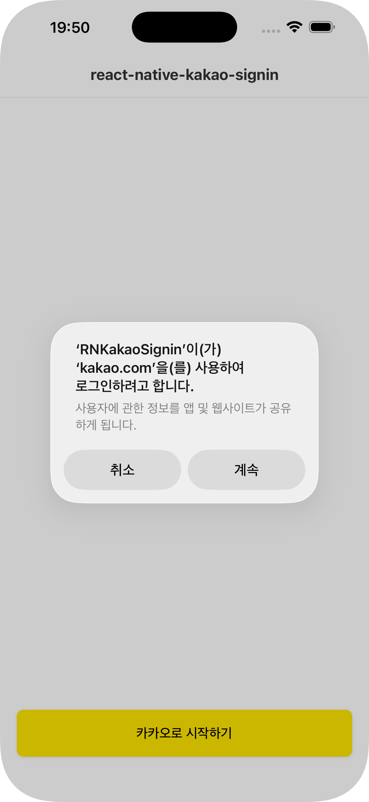
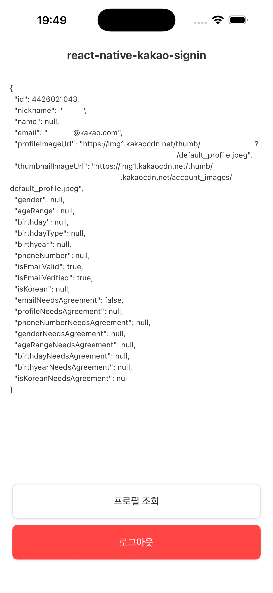

<div align="center">

# @package-kr/react-native-kakao-signin

[](https://www.npmjs.com/package/@package-kr/react-native-kakao-signin)
[](https://www.npmjs.com/package/@package-kr/react-native-kakao-signin)


React Native 전용 카카오 로그인 라이브러리 입니다.

<p align="center">
  
  &nbsp;&nbsp;&nbsp;&nbsp;&nbsp;&nbsp;&nbsp;&nbsp;&nbsp;&nbsp;
  
</p>

</div>

## Getting started

해당 라이브러리는 React Native `0.68` 이상을 지원합니다.<br/><br/>
`TurboModule` 기반으로 구현되어 있어 `New Architecture`를 지원하며,<br/>
`Auto Linking`이 적용되어 있어 별도 네이티브 모듈 연결 작업이 필요 없습니다.<br/>

RN Expo와 v0.68 미만은 추후 지원 예정입니다.

## Prerequisites

라이브러리를 사용하려면 먼저 [카카오 개발자 콘솔](./docs/KAKAO_CONSOLE_SETUP.md)에서 앱 등록과 플랫폼 설정을 완료해야 합니다.

## Installation

```sh
npm install @package-kr/react-native-kakao-signin
```

## iOS

### 1. Info.plist 설정

`ios/{ProjectName}/Info.plist`에서 `{KAKAO_APP_KEY}` 부분을 카카오 네이티브 앱 키로 교체해주세요.

<details>
<summary>복사용</summary>

```xml
	<key>CFBundleURLTypes</key>
	<array>
		<dict>
			<key>CFBundleTypeRole</key>
			<string>Editor</string>
			<key>CFBundleURLName</key>
			<string>KAKAO</string>
			<key>CFBundleURLSchemes</key>
			<array>
				<string>kakao{KAKAO_APP_KEY}</string>
			</array>
		</dict>
	</array>
	<key>CFBundleVersion</key>
	<string>$(CURRENT_PROJECT_VERSION)</string>
	<key>KAKAO_APP_KEY</key>
	<string>{KAKAO_APP_KEY}</string>
	<key>LSApplicationQueriesSchemes</key>
	<array>
		<string>kakao{KAKAO_APP_KEY}</string>
		<string>kakaokompassauth</string>
		<string>kakaotalk</string>
	</array>
```

</details>

```diff
	<!-- Info.plist -->
	<key>CFBundleURLTypes</key>
	<array>
+		<dict>
+			<key>CFBundleTypeRole</key>
+			<string>Editor</string>
+			<key>CFBundleURLName</key>
+			<string>KAKAO</string>
+			<key>CFBundleURLSchemes</key>
+			<array>
+				<string>kakao{KAKAO_APP_KEY}</string>
+			</array>
+		</dict>
	</array>
	<key>CFBundleVersion</key>
	<string>$(CURRENT_PROJECT_VERSION)</string>
+	<key>KAKAO_APP_KEY</key>
+	<string>{KAKAO_APP_KEY}</string>
+	<key>LSApplicationQueriesSchemes</key>
+	<array>
+		<string>kakaoa{KAKAO_APP_KEY}</string>
+		<string>kakaokompassauth</string>
+		<string>kakaotalk</string>
+	</array>
```

### 2. CocoaPods 설치

```sh
cd ios && pod install
```

## Android

### 1. Redirect URI 설정

`app/src/main/AndroidManifest.xml`에 카카오 리다이렉트 액티비티를 추가합니다.<br/>
`{KAKAO_APP_KEY}` 부분을 카카오 네이티브 앱 키로 교체해주세요.

사용자 휴대폰에 카카오 앱이 설치되어 있을 경우 로그인 후 앱으로 돌아오기 위한 설정입니다.<br/>
Android 12(API 31) 이상을 타깃하는 경우 `android:exported="true"` 를 반드시 선언해주셔야 합니다.

```xml
	  <!-- AndroidManifest.xml -->
      <activity
        android:name="com.kakao.sdk.auth.AuthCodeHandlerActivity"
        android:exported="true">
        <intent-filter>
            <action android:name="android.intent.action.VIEW" />
            <category android:name="android.intent.category.DEFAULT" />
            <category android:name="android.intent.category.BROWSABLE" />
            <data android:host="oauth" android:scheme="kakao{KAKAO_APP_KEY}" />
        </intent-filter>
      </activity>
```

### 2. 카카오 앱 키 설정

`app/src/main/res/values/strings.xml`에 카카오 앱 키를 추가합니다.<br/>
카카오 SDK가 앱 키를 자동으로 읽어오기 위한 설정입니다.

```diff
  <resources>
      <string name="app_name">YourAppName</string>
+     <string name="kakao_app_key">{KAKAO_APP_KEY}</string>
  </resources>
```

## Usage

더 많은 사용 예제는 [KakaoLoginExample](https://github.com/Package-KR/react-native-kakao-signin/tree/main/KakaoLoginExample) 프로젝트를 참고해주세요.

```ts
import {
  login,
  loginWithKakaoAccount,
  logout,
  unlink,
  getProfile,
  getAccessToken,
  shippingAddresses,
  serviceTerms,
} from '@package-kr/react-native-kakao-signin';

// 카카오톡으로 로그인 (카카오톡 미설치 시 카카오계정으로 자동 전환)
const token = await login();

// 카카오계정으로 로그인
const token = await loginWithKakaoAccount();

// 로그아웃
await logout();

// 연결 해제
await unlink();

// 프로필 조회
const profile = await getProfile();

// 토큰 조회
const token = await getAccessToken();

// 배송주소 조회
const addresses = await shippingAddresses();

// 서비스 약관 조회
const terms = await serviceTerms();
```

---

## Methods

| 메서드                    | 설명                                                                                 | Returns                           |
| ------------------------- | ------------------------------------------------------------------------------------ | --------------------------------- |
| `login()`                 | 카카오톡으로 로그인합니다. 카카오톡 미설치 시 카카오계정 로그인으로 자동 전환됩니다. | `Promise<KakaoOAuthToken>`        |
| `loginWithKakaoAccount()` | 카카오계정으로 로그인합니다.                                                         | `Promise<KakaoOAuthToken>`        |
| `logout()`                | 로그아웃합니다.                                                                      | `Promise<string>`                 |
| `unlink()`                | 카카오 계정 연결을 해제합니다.                                                       | `Promise<string>`                 |
| `getProfile()`            | 사용자 프로필을 조회합니다.                                                          | `Promise<KakaoProfile>`           |
| `getAccessToken()`        | 현재 저장된 액세스 토큰을 조회합니다.                                                | `Promise<KakaoAccessTokenInfo>`   |
| `shippingAddresses()`     | 사용자 배송주소 목록을 조회합니다.                                                   | `Promise<KakaoShippingAddresses>` |
| `serviceTerms()`          | 서비스 약관 동의 내역을 조회합니다.                                                  | `Promise<KakaoServiceTerms>`      |

---

## Types

### `KakaoOAuthToken`

| 필드                    | 타입               | 설명                     |
| ----------------------- | ------------------ | ------------------------ |
| `accessToken`           | `string`           | 액세스 토큰              |
| `refreshToken`          | `string`           | 리프레시 토큰            |
| `idToken`               | `string \| null`   | ID 토큰 (OpenID Connect) |
| `accessTokenExpiresAt`  | `string`           | 액세스 토큰 만료 시각    |
| `refreshTokenExpiresAt` | `string`           | 리프레시 토큰 만료 시각  |
| `scopes`                | `string[] \| null` | 인증된 스코프 목록       |

### `KakaoProfile`

| 필드                            | 타입              | 설명                              |
| ------------------------------- | ----------------- | --------------------------------- |
| `id`                            | `number \| null`  | 사용자 ID                         |
| `nickname`                      | `string \| null`  | 닉네임                            |
| `name`                          | `string \| null`  | 이름                              |
| `email`                         | `string \| null`  | 이메일                            |
| `profileImageUrl`               | `string \| null`  | 프로필 이미지 URL                 |
| `thumbnailImageUrl`             | `string \| null`  | 프로필 썸네일 이미지 URL          |
| `gender`                        | `string \| null`  | 성별                              |
| `ageRange`                      | `string \| null`  | 연령대                            |
| `birthday`                      | `string \| null`  | 생일 (MMDD)                       |
| `birthdayType`                  | `string \| null`  | 생일 타입 (SOLAR/LUNAR)           |
| `birthyear`                     | `string \| null`  | 출생 연도                         |
| `phoneNumber`                   | `string \| null`  | 전화번호                          |
| `isEmailValid`                  | `boolean \| null` | 이메일 유효 여부                  |
| `isEmailVerified`               | `boolean \| null` | 이메일 인증 여부                  |
| `isKorean`                      | `boolean \| null` | 한국인 여부                       |
| `isDefaultImage`                | `boolean \| null` | 기본 프로필 이미지 여부           |
| `isLeapMonth`                   | `boolean \| null` | 생일 윤달 여부 (Android only)     |
| `connectedAt`                   | `string \| null`  | 서비스 연결 시각                  |
| `synchedAt`                     | `string \| null`  | 카카오싱크 로그인 시각            |
| `ci`                            | `string \| null`  | 연계정보 (iOS only)               |
| `ciAuthenticatedAt`             | `string \| null`  | CI 발급 시각 (iOS only)           |
| `legalName`                     | `string \| null`  | 법정 이름                         |
| `legalBirthDate`                | `string \| null`  | 법정 생년월일                     |
| `legalGender`                   | `string \| null`  | 법정 성별                         |
| `emailNeedsAgreement`           | `boolean \| null` | 이메일 제공 동의 필요 여부        |
| `profileNeedsAgreement`         | `boolean \| null` | 프로필 제공 동의 필요 여부        |
| `phoneNumberNeedsAgreement`     | `boolean \| null` | 전화번호 제공 동의 필요 여부      |
| `genderNeedsAgreement`          | `boolean \| null` | 성별 제공 동의 필요 여부          |
| `ageRangeNeedsAgreement`        | `boolean \| null` | 연령대 제공 동의 필요 여부        |
| `birthdayNeedsAgreement`        | `boolean \| null` | 생일 제공 동의 필요 여부          |
| `birthyearNeedsAgreement`       | `boolean \| null` | 출생 연도 제공 동의 필요 여부     |
| `isKoreanNeedsAgreement`        | `boolean \| null` | 한국인 여부 제공 동의 필요 여부   |
| `profileNicknameNeedsAgreement` | `boolean \| null` | 닉네임 제공 동의 필요 여부        |
| `profileImageNeedsAgreement`    | `boolean \| null` | 프로필 이미지 제공 동의 필요 여부 |
| `nameNeedsAgreement`            | `boolean \| null` | 이름 제공 동의 필요 여부          |
| `ciNeedsAgreement`              | `boolean \| null` | CI 제공 동의 필요 여부 (iOS only) |
| `legalNameNeedsAgreement`       | `boolean \| null` | 법정 이름 제공 동의 필요 여부     |
| `legalBirthDateNeedsAgreement`  | `boolean \| null` | 법정 생년월일 제공 동의 필요 여부 |
| `legalGenderNeedsAgreement`     | `boolean \| null` | 법정 성별 제공 동의 필요 여부     |

### `KakaoAccessTokenInfo`

| 필드          | 타입     | 설명                    |
| ------------- | -------- | ----------------------- |
| `accessToken` | `string` | 액세스 토큰             |
| `expiresIn`   | `string` | 만료까지 남은 시간 (초) |

### `KakaoShippingAddresses`

| 필드                | 타입                     | 설명           |
| ------------------- | ------------------------ | -------------- |
| `userId`            | `string`                 | 사용자 ID      |
| `needsAgreement`    | `boolean`                | 동의 필요 여부 |
| `shippingAddresses` | `KakaoShippingAddress[]` | 배송주소 목록  |

### `KakaoShippingAddress`

| 필드                   | 타입      | 설명              |
| ---------------------- | --------- | ----------------- |
| `id`                   | `string`  | 배송주소 ID       |
| `name`                 | `string`  | 배송지명          |
| `isDefault`            | `boolean` | 기본 배송지 여부  |
| `updatedAt`            | `string`  | 수정 시각         |
| `type`                 | `string`  | 배송지 타입       |
| `baseAddress`          | `string`  | 기본 주소         |
| `detailAddress`        | `string`  | 상세 주소         |
| `receiverName`         | `string`  | 수령인 이름       |
| `receiverPhoneNumber1` | `string`  | 수령인 전화번호 1 |
| `receiverPhoneNumber2` | `string`  | 수령인 전화번호 2 |
| `zoneNumber`           | `string`  | 우편번호          |
| `zipCode`              | `string`  | 구 우편번호       |

### `KakaoServiceTerms`

| 필드           | 타입                 | 설명             |
| -------------- | -------------------- | ---------------- |
| `userId`       | `string`             | 사용자 ID        |
| `serviceTerms` | `KakaoServiceTerm[]` | 서비스 약관 목록 |

### `KakaoServiceTerm`

| 필드        | 타입                  | 설명           |
| ----------- | --------------------- | -------------- |
| `tag`       | `string`              | 약관 태그      |
| `agreed`    | `boolean`             | 동의 여부      |
| `required`  | `boolean`             | 필수 여부      |
| `revocable` | `boolean`             | 철회 가능 여부 |
| `agreedAt`  | `string \| undefined` | 동의 시각      |

## 라이선스

MIT
